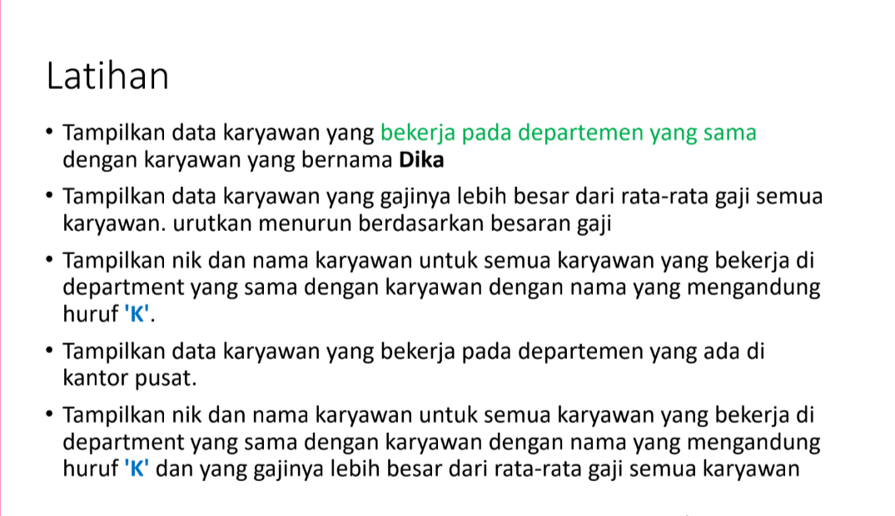
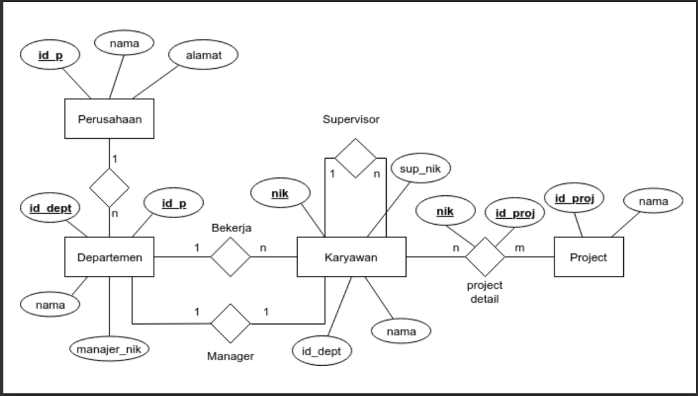
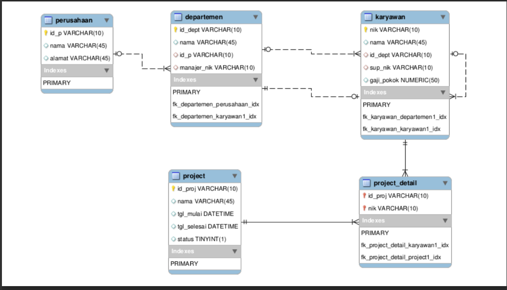
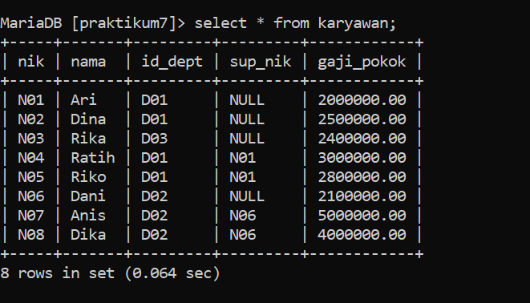
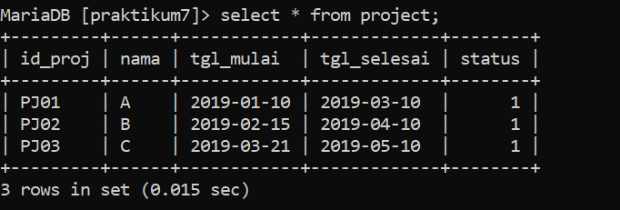
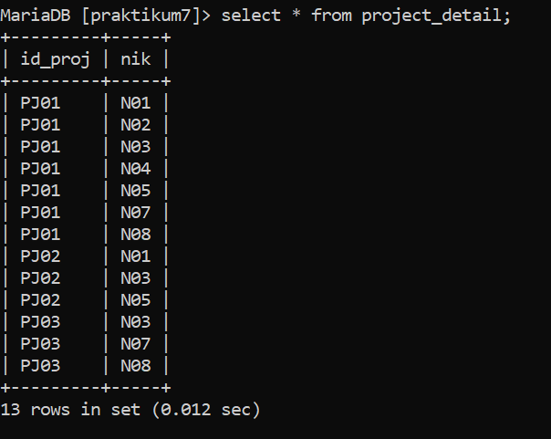

# praktikum8
```
Febriyani Nurhida
312210222
TI.22.A2
```

# Sub Query
## Latihan



### ERD







### TABEL DAN INPUT DATA

* TABEL KARYAWAN


* TABEL DEPARTEMEN


* TABEL PERUSAHAAN


* TABEL PROJECT


* TABEL PROJECT_DETAIL


### MENGIDENTIFIKASI QUERY

Berikut adalah contoh query SQL NYA:

```sql
-- Tampilkan data karyawan yang bekerja pada departemen yang sama dengan karyawan yang bernama Dika
SELECT k1.*
FROM karyawan k1
JOIN karyawan k2 ON k1.id_dept = k2.id_dept
WHERE k2.nama = 'Dika';
```

output :


```sql
-- Tampilkan data karyawan yang gajinya lebih besar dari rata-rata gaji semua karyawan. Urutkan menurun berdasarkan besaran gaji.
SELECT *
FROM karyawan
WHERE gaji_pokok > (SELECT AVG(gaji_pokok) FROM karyawan)
ORDER BY gaji_pokok DESC;
```

output :


```sql
-- Tampilkan nik dan nama karyawan untuk semua karyawan yang bekerja di departemen yang sama dengan karyawan dengan nama yang mengandung huruf 'K'.
SELECT k.nik, k.nama
FROM karyawan k
JOIN departemen d ON k.id_dept = d.id_dept
WHERE d.id_dept IN (
  SELECT id_dept
  FROM karyawan
  WHERE nama LIKE '%K%'
);
```

output :


```sql
-- Tampilkan data karyawan yang bekerja pada departemen yang ada di kantor pusat.
SELECT k.*
FROM karyawan k
JOIN departemen d ON k.id_dept = d.id_dept
WHERE d.id_p = 'P01';
```

output :


```sql
-- Tampilkan nik dan nama karyawan untuk semua karyawan yang bekerja di departemen yang sama dengan karyawan dengan nama yang mengandung huruf 'K' dan gajinya lebih besar dari rata-rata gaji semua karyawan.
SELECT k.nik, k.nama
FROM karyawan k
JOIN departemen d ON k.id_dept = d.id_dept
WHERE k.gaji_pokok > (SELECT AVG(gaji_pokok) FROM karyawan) AND k.nama LIKE '%K%';
```


output :


Pastikan untuk menyesuaikan nama tabel dan kolom dengan struktur tabel yang sebenarnya dalam database Anda.


